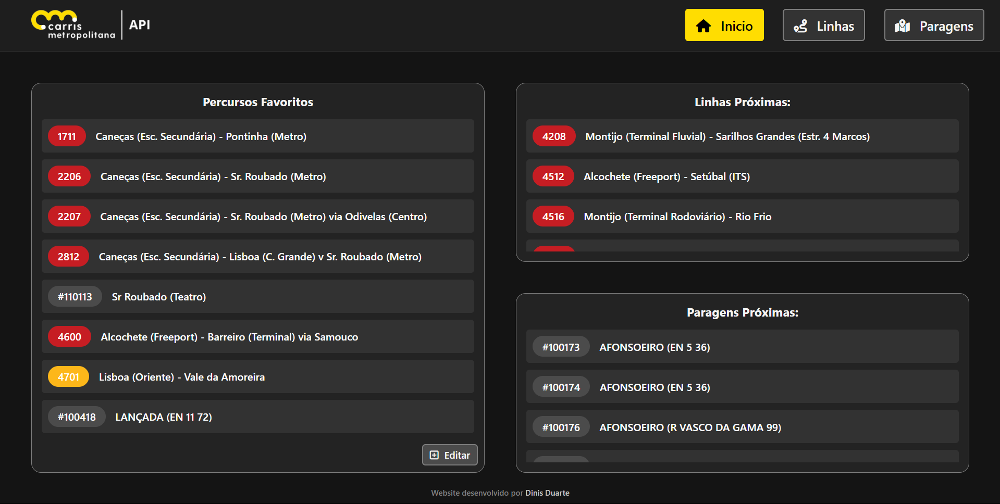
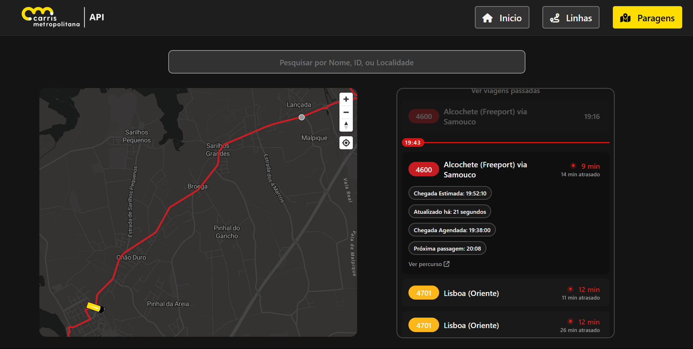
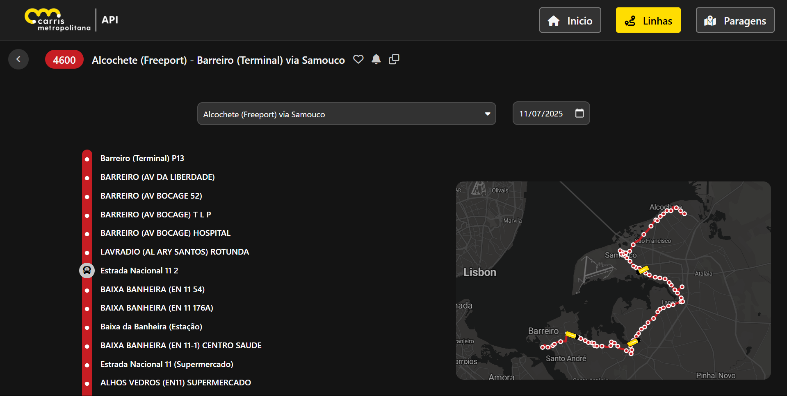

# API | CARRIS METROPOLITANA [BETA]
The BETA version of this APP brings more stability and responsiveness to the previous made one.
With a web application created from scratch to improve the user experience when using the features.
Implemented some new features that you sure will love. Check them out!

# NEW FEATURES
- NodeJS server with endpoints that let user dive around the app more easilly
- A new home page with your favorite stops and lines.
- Home page with nearby stops and lines from user location
- More information when viewing a line and stops
- A new notifications system thats doesn't let you miss your bus (Doesn't work on mobile for now)

# FUTURE IDEAS
- Change the favorites, to show the user only the routes, lines and stop info he wants
- Settings page that lets user change notification times, app theme, ...
- Locale language (Portuguese / English / Spanish)

- # IMAGES

